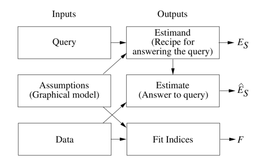

```{r setup, include=FALSE, warning=FALSE}
knitr::opts_chunk$set(echo = TRUE)
rm(list=ls())
```

For our Population Health Data Science (PHDS)[^phds] book club at the
San Francisco Department of Public Health we are reading Judea Pearl's
*The Book of Why* (TBoW) (<http://bayes.cs.ucla.edu/WHY/>)
[@Pearl2018_isbn978-0465097609].

[^phds]: Population health is a systems approach to studying and improving the health of populations through collective action and learning. PHDS is the art and science of transforming data into information and actionable knowledge that informs, influences or optimizes decisions and actions that protect and improve health.

These are my notes for selected (hopefully all the) chapters. The
notes are not comprehensive, and sometimes present an outline or
expansion of concepts covered in the book. I've inserted some personal
insights that I hope you find informative.

# 0 Mind over Data {-}

**Some definitions**

1. causal inference
2. strong artificial intelligence
3. big data, machine learning, deep learning

**Limitations of mathematics for causal inference**

Consider that a barometer reading ($B$) is a function of atmospheric
pressure ($P$) and a constanct ($k$). 

$$
\begin{aligned}
B &= k P \\
P &= B / k \\
k &= B/P
\end{aligned}
$$

**Questions**

1. What are limitations of mathematical equations for causality?
2. Why did it take so long for humans to develop a science of causality?
3. Do you agree with Pearl that "data are profoundly dumb"? Why or why
   not?


**Calculus of causation** (p. 7)

Judea Pearl calls the mathematical framework that led to this transformation
Structural Causal Models (SCM). The SCM deploys three parts

1. Graphical models,
2. Structural equations, and
3. Counterfactual and interventional logic

What is the difference between *seeing* and *doing*, and why does it
matter?

What is a counterfactual?

The "Inference Engine" (Figure 1 on p. 12 of TBoW). 

```{r fig.p12, echo=FALSE, out.width="7in", fig.pos="ht", fig.align = "center", , fig.cap = "The Inference Engine"}
knitr::include_graphics("./Figs/IMG_Figure-p12.pdf")
```

1. knowledge (mostly implicit)
2. assumptions (explicit)
3. causal models (i.e., SCM)
4. testable implications
5. queries; e.g., $P(L \mid do(D))$
6. estimand; e.g., $P(L \mid D, Z) \times P(Z)$
7. data
8. statistical estimation
9. estimate

Here is an alternative depiction of the inference engine
[@Pearl2019_doi-10.1145-3241036].

```{r fig.p12b, echo=FALSE, out.width="7in", fig.pos="ht", fig.align = "center", , fig.cap = "Alternative depiction of Inference Engine"}

```


**Chapters ahead**

1. The Ladder of Causation is observation (seeing), intervention
   (doing), and counterfactual (imagining)
2. "how the discipline of statistics inflicted causal blindness on itself"
3. "how I became a convert to causality through my work in AI and
   \ldots\ Bayesian networks."
4. "the major contribution of statistics to causal inference: the
   randomized controlled trial (RCT)"
5. Causation in the absence of a RCT: case study of smoking and lung
   cancer
6. Paradoxes that stumped the brightest minds for many years
7. Rung 2---interventions
8. Rung 3---counterfactuals
9. Mediation: The Search for a Mechanism
10. Big Data and strong AI

## REFLECTION: Book club as an intervention {-}

A book club is an intervention. Book club participation could be

a. mandatory
b. incentivized
c. voluntary

I (PHD director) *chose* to make the book club *voluntary*.

Staff *chose* (self-select) to participate or not. 

> **Insight:** Every *decision* has a *causal assumption* (causal
> inference) and a *prediction* (probabilistic reasoning). If my
> long-term goal is to spread causal thinking, what short term causal
> models did I likely consider that led to making the book club
> voluntary? For staff, what causal models did they consider in
> self-selecting to participate in the book club? If months later I
> show good data that those who attended the book club improved their
> work performance compared to those who did not attend, what causal
> inferences can I make or not make? Explain your reasoniing.


# Ladder of Causation

Table \vref{tab:causalhierarchy} (adapted from
[@Pearl2019_doi-10.1145-3241036]) corresponds to the Ladder of
Causation on p.\ 28 of TBoW.

Table: The Causal Hierarchy. Questions at level $i$ can only be answered if information from level $i$ or higher is available.\label{tab:causalhierarchy}

| $i$ | Level                | Activity      | Questions                                     |
|:---:+----------------------+---------------+----------------------------------------------- |
|   1 | Association          | Seeing        | What if I *see* \ldots?                       |
|     | $P(y \mid x)$        |               | How would seeing $X$ change my belief in $Y$? |
|     |                      |               | Are $X$ and $Y$ correlated (associated)?      |
|     |                      |               | Does $X$ predict $Y$?                         |
|     |                      |               | What are the predictors of $Y$?               |
|     |                      |               |                                               |
|   2 | Intervention         | Doing         | What if I *do* \ldots?                        |
|     | $P(y \mid do(x), y)$ | Intervening   | How would doing $X$ change $Y$?               |
|     |                      |               | How can I change $Y$?                         |
|     |                      |               |                                               |
|   3 | Counterfactuals      | Imagining     | What if I *had done* \ldots?                  |
|     | $P(y_x \mid x', y')$ | Retrospection | Was it $X$ that caused $Y$?                   |
|     |                      |               | What if I had acted differently?              |
|     |                      |               | What caused $Y$?                              |
|     |                      |               | What are the causes of $Y$?                   |


> **Insight:** Between *seeing* and *doing* is *choosing*. Choice can
> be based on *intuition* ("gut", nonconscious) and/or *deliberation*
> (conscious, reflection, discussion). Choice always involves a
> *causal assumption* (causal inference) and *prediction*
> (probabilistic reasoning). Together, causal inference, probabilistic
> reasoning, and decision-making are the core competencies of
> **population health thinking** (PHT). PHT supports PHDS.

Figure \vref{fig:p39fig1.4} is the causal diagram for the firing squad
example (TBoW, p. 39).

\begin{figure}[htb]
\centering
\begin{tikzpicture}
    \node (a) at (0,0) [label=left:A,point];
    \node (b) at (3,0) [label=right:B,point];
	\node (c) at (1.5,1.5) [label=right:C,point];
	\node (d) at (1.5,-1.5) [label=below:D,point];
	\node (co) at (1.5,1.5+1) [label=above:CO,point];
	\path (co) edge (c);
    \path (c) edge (a);
	\path (c) edge (b);
	\path (a) edge (d);
	\path (b) edge (d);
\end{tikzpicture}
\caption{Causal diagram for the firing squad example in TBoW, p. 39
(Figure 1.4). A and B represent (the actions of) Soldiers A and B. CO =
Court Order and C = Captain.}
\label{fig:p39fig1.4}
\end{figure}

Although not presented in the book, these are the *structural
equations* for Figure \ref{fig:p39fig1.4} where $0=$ false and $1=$ true.

\begin{equation}
  f_{CO} : CO=\begin{cases}
    \text{1\ or\ 0}
  \end{cases}
\end{equation}
\begin{equation}
  f_{C} : C=\begin{cases}
    \text{1}, & \text{if $CO$ = 1}.\\
    \text{0}, & \text{if $CO$ = 0}.
  \end{cases}
\end{equation}
\begin{equation}
  f_{A} : A=\begin{cases}
    \text{1}, & \text{if $C$ = 1}.\\
    \text{0}, & \text{if $C$ = 0}.
  \end{cases}
\end{equation}
\begin{equation}
  f_{B} : B=\begin{cases}
    \text{1}, & \text{if $C$ = 1}.\\
    \text{0}, & \text{if $C$ = 0}.
  \end{cases}
\end{equation}
\begin{equation}
  f_{D} : D=\begin{cases}
    \text{1}, & \text{if $A$ = 1 or $B$ = 1}.\\
    \text{0}, & \text{if $A$ = 0 and $B$ = 0}.
  \end{cases}
\end{equation}

\clearpage

**Interventional reasoning:** If Soldier A decides to fire on his or
her own volition, this is an *intervention* ($A=1$). Now, the
probability of death is $P(D \mid do(A=1), B)$.  In a causal
graph an intervention is depicted by *removing* all arrows pointing
into node $A$ and setting value of $A$ to true, and keeping the
remaining nodes are unchanged (Figure \vref{fig:p41fig1.5}).


\begin{figure}[htb]
\centering
\begin{tikzpicture}
    \node (a) at (0,0) [label=left:{A = 1},point];
    \node (b) at (3,0) [label=right:B,point];
	\node (c) at (1.5,1.5) [label=right:C,point];
	\node (d) at (1.5,-1.5) [label=below:D,point];
	\node (co) at (1.5,1.5+1) [label=above:CO,point];
	\path (co) edge (c);
    %\path (c) edge (a);
	\path (c) edge (b);
	\path (a) edge (d);
	\path (b) edge (d);
\end{tikzpicture}
\caption{Interventional reasoning (from TBoW, p.\ 41). What
\emph{would happen if} Soldier A decides to fire? Soldier A
decides to fire; arrow from C to A is deleted, and A is assigned the
value true.}
\label{fig:p41fig1.5}
\end{figure}


**Counterfactual reasoning:** If we observe a dead prisoner, we could
ask: What \emph{would have happened if} Soldier A had decided *not* to
fire?  This is a retrospective counterfactual intervention at node $A$
($A=0$) knowing that the other nodes must have be set to
true. Figure \vref{fig:p42fig1.6} depicts this counterfactual
intervention.  This is why it looks very similar to Figure
\vref{fig:p41fig1.5} (i.e., no arrows pointing into to node $A$). 


\begin{figure}[htb]
\centering
\begin{tikzpicture}
    \node (a) at (0,0) [label=left:{A = 0},point];
    \node (b) at (3,0) [label=right:{B = 1},point];
	\node (c) at (1.5,1.5) [label=right:{C = 1},point];
	\node (d) at (1.5,-1.5) [label=below:{D = ?},point];
	\node (co) at (1.5,1.5+1) [label=above:{CO = 1},point];
	\path (co) edge (c);
    %\path (c) edge (a);
	\path (c) edge (b);
	\path (a) edge (d);
	\path (b) edge (d);
\end{tikzpicture}
\caption{Counterfactual reasoning (from TBoW, p.\ 42). We observe that
the prisoner is dead and ask: What \emph{would have happened if} Soldier A had
decided not to fire?}
\label{fig:p42fig1.6}
\end{figure}

\clearpage

## EXAMPLE: Smallpox vaccination (p.\ 44) {-}

Assume that smallpox is an ongoing infectious disease threat.  Suppose
that out 1 million children, 99 percent are vaccinated against
smallpox. Among the vaccinated, 9900 have a reaction, and 99
die. Among the 10,000 children not vaccinated, 200 get smallpox, and
40 die. The newspaper headlines read "More children died from smallpox
vaccination than smallpox." 

How do you explain the impact of the vaccination campaign?

\begin{figure}[htb]
\centering
\begin{tikzpicture}
    \node (r) at (0,0) [label=left:{Reaction},point];
    \node (s) at (3,0) [label=right:{Smallpox},point];
	\node (v) at (1.5,1.5) [label=above:{Vaccination},point];
	\node (d) at (1.5,-1.5) [label=below:{Death},point];
    \path (v) edge (r);
	\path (v) edge (s);
	\path (r) edge (d);
	\path (s) edge (d);
\end{tikzpicture}
\caption{Causal diagram for the vaccination example (from TBoW, p.\
45). Is vaccination beneficial or harmful?}
\label{fig:p45fig1.7}
\end{figure}

Counterfactual reasoning is how we retrospectively **measure impact** for a
completed intervention. This can only be accomplished with a causal
model. Here is the information available for each variable (node).

| Variable node | Probability            |
|---------------+------------------------|
| Vaccination   | $P(V=1)=0.99$          |
| Reaction      | $P(R=1 \mid V=1)=0.01$ |
|               | $P(R=1 \mid V=0)=0$    |
| Smallpox      | $P(S=1 \mid V=1)=0$    |
|               | $P(S=1 \mid V=0)=0.02$ |
| Death         | $P(D=1 \mid R=1)=0.01$ |
|               | $P(D=1 \mid S=1)=0.2$  |


1 - (Surviving reaction)(Surviving smallpox)(Surviving reaction and smallpox)


<!--
# From Buccaneers to Guinea Pigs: The Genesis of Causal Inference

# From Evidence to Causes: Reverend Bayes Meets Mr. Holmes

# Confounding and Deconfounding: Or, Slaying the Lurking Varialbe

# The Smoke-Filled Debate: Clearning the Air

# Paradoxes Galore!

# Beyond Adjustment: The Conquest of Mount Intervention

# Counterfactuals: Mining Worlds That Could Have Been

# Mediation: The Search for a Mechanism

# Big Data, Artificial Intelligence, and the Big Questions
--> 


\clearpage

# References {-}

\setlength{\parindent}{-0.2in}
\setlength{\leftskip}{0.2in}
\setlength{\parskip}{8pt}
\vspace*{-0.2in}
\noindent


<!--
% ---
% nocite: | 
%   @Visconti2015_pmid26077643
% ...
-->


